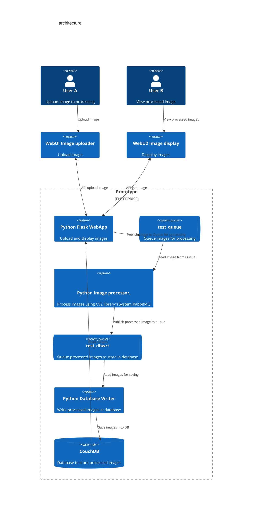

# learnamqp - Learing Python Pika and rabbit MQ. Simple prototype.

## Short description
The main idea of the prototype is to transfer binary objects through RabbitMQ queues and process that objects. As processor I have chosen a simple image processor by using the python open-cv library. Image processing  does two simple steps: makes image gray, transform image byte array into .png. Then, processed image saves into NoSql Database. Processed images that had stored in database can be viewed from web page  

## Used tools
- [Docker RabbitMQ](https://hub.docker.com/_/rabbitmq/)
- [Docker CouchDB](https://hub.docker.com/_/couchdb)
- [RedHat  Python 3.9  container for running various Python applications](https://catalog.redhat.com/software/containers/ubi9/python-39/61a61032bfd4a5234d59629e)
- [Docker Compose](https://docs.docker.com/compose/)
- [Pika Python library for Rabbit MQ](https://pypi.org/project/pika/)
- [IBM Cloudant library for Cloudant and CouchDB](https://cloud.ibm.com/apidocs/cloudant?code=python)

## An Architecture of the prototype




## Користні лінки

[Docker RabbitMQ](https://hub.docker.com/_/rabbitmq/)
[Rabbit tutorials](https://www.rabbitmq.com/tutorials)
[habre](https://habr.com/ru/articles/434510/)
[Getting Started with RabbitMQ and Python: A Practical Guide. Docker compose](https://dev.to/felipepaz/getting-started-with-rabbitmq-and-python-a-practical-guide-57fi)

https://github.com/pazfelipe/python-rabbitmq/tree/main


## RUN DOCKER

```bash
docker pull rabbitmq

docker run -d --hostname my-rabbit --name some-rabbit rabbitmq:3

docker run -d --hostname my-rabbit --name some-rabbit -e RABBITMQ_DEFAULT_USER=user -e RABBITMQ_DEFAULT_PASS=password rabbitmq:3-management

docker run -d --hostname my-rabbit --name some-rabbit -e RABBITMQ_DEFAULT_VHOST=my_vhost rabbitmq:3-management

docker-compose up -d
```

Got to the management console

http://localhost:15672/

guest/guest

http://localhost:5984/_utils/
devadm/qq


```bash

#docker-compose -f docker-compose-websender.yaml up --remove-orphans --build sender-web  receiver_web

docker-compose -f docker-compose-websender.yaml stop

docker-compose -f docker-compose-websender.yaml up --remove-orphans --build sender-web receiver-web writer-web

```


soket io
https://medium.com/the-research-nest/how-to-log-data-in-real-time-on-a-web-page-using-flask-socketio-in-python-fb55f9dad100


https://dhruvadave5297.medium.com/demo-application-for-background-processing-with-rabbitmq-python-flask-c3402bdcf7f0


# How to encode OpenCV Image as bytes using Python
https://stackoverflow.com/questions/59259786/how-to-encode-opencv-image-as-bytes-using-python/59260369#59260369

```text


I am having difficulty sending a jpeg opened with cv2 to a server as bytes. The server complains that the file type is not supported. I can send it without problems using Python's "open" function, but not with OpenCV. How can I get this to work?

```

```text


I want to start by getting your test case working, we will do this by using a lossless format with no compression so we are comparing apples to apples:
```

```python

import cv2

path_in = r".\test\frame1.jpg"
path_temp = r".\test\frame1.bmp"
img = cv2.imread(path_in, -1)
cv2.imwrite(path_temp, img) # save in lossless format for a fair comparison

with open(path_temp, "rb") as image:
    image1 = image.read()

image2 = cv2.imencode(".bmp", img)[1].tobytes() #also tried tostring()

print(image1 == image2)
#This prints True. 
```


I want to start by getting your test case working, we will do this by using a lossless format with no compression so we are comparing apples to apples:

```
import cv2

path_in = r".\test\frame1.jpg"
path_temp = r".\test\frame1.bmp"
img = cv2.imread(path_in, -1)
cv2.imwrite(path_temp, img) # save in lossless format for a fair comparison

with open(path_temp, "rb") as image:
    image1 = image.read()

image2 = cv2.imencode(".bmp", img)[1].tobytes() #also tried tostring()

print(image1 == image2)

#This prints True. 
```

This is not ideal since compression is desirable for moving around bytes, but it illustrates that there is nothing inherently wrong with your encoding.

Without knowing the details of your server it is hard to know why it isn't accepting the opencv encoded images. Some suggestions are:

    provide format specific encoding parameters as described in the [docs](https://docs.opencv.org/3.4/d4/da8/group__imgcodecs.html#ga461f9ac09887e47797a54567df3b8b63), available flags are [here](https://docs.opencv.org/3.4/d4/da8/group__imgcodecs.html#ga292d81be8d76901bff7988d18d2b42ac)
    try different extensions

## Cloudant

https://docs.couchdb.org/en/stable/
https://pypi.org/project/ibmcloudant/#authentication-with-environment-variables
https://cloud.ibm.com/apidocs/cloudant?code=python
